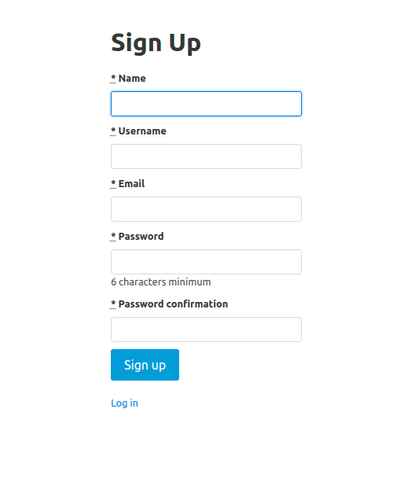

# re-former

A rails Twitter CLone
> Project is all about building a light weight version of Twitter and use Devise in the process. Project is based on The Odin Project’s Ruby on Rails Curriculum. Find it at https://www.theodinproject.com/courses/ruby-on-rails/lessons/authentication

 
## Built With

- RUBY
- Ruby On Rails
- Visual Code

## GET STARTED

#### Requirements 

- At least one code editor installed (VS Code for example)
- Git installed
- Ruby installed
- At least one web browser
#### Clone the repository

- Click on the "code" button above on this page and copy the link to the repository
- Run `git clone git@github.com:RailonA/twitter-clone.git`
- Go to the cloned repository run `cd twitter-clone`

#### Installe required Gem

- In the terminale, run `bundle install`
- [optional] Run `bundle update`

#### Set up the database tables 

Run `rails db:migrate` and make sure the commande succeded

#### Test the tables

- First run `rails c`
- In the rails console make sure all the tables are working correctly. Run `User`
- Then create at least one user, one post and one comment Run 
1. `u = User.create(user_name: 'Railon A', email: 'railonacosta@gmail.com', password: 'Abc@123!', password_confirmation: 'Abc@123!')` Creates a user
2. `pp User.first` shows details of the first user

#### Test all in the browser

- Run `$ rails server`
- In the browser go to http://127.0.0.1:3000/users/sign_up
- This page should display ⬇️
- 
- Create a new user by putting informations inside the text fields

## 🤝 Contributing

Contributions, issues and feature requests are welcome!
## Authors

👤 **Railon Acosta**
- GitHub: [@railonA](https://github.com/RailonA)
- Linkedin: [@railonAcosta](https://www.linkedin.com/in/railon-acosta-81265180/)
- Twitter: [@railonAcosta](https://twitter.com/RailonAcosta)

